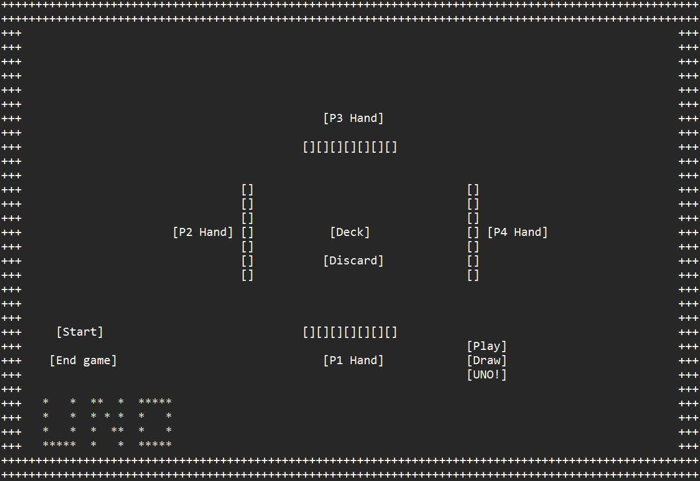

# C# UNO Game Project - Design Document

**Author:** Daniel Critchlow Jr

**Date:** February 11 2025

## Introduction

This document outlines the design and implementation plan for a C# implementation of the classic UNO card game. The project will be object-oriented and presented in a graphical user interface (GUI).  This document details the game's rules, object structure, game logic, and planned features.

## Table of Contents

*   [Game Rules](#game-rules)
*   [Game Design](#game-design)
*   [Object Model](#object-model)
*   [Game Logic](#game-logic)
*   [UI/UX Considerations](#uiux-considerations)
*   [Game Board Concept](#game-board-concept)
*   [Future Enhancements](#future-enhancements)
*   [Project To-Do List](#project-to-do-list)

## Game Rules 

This project will implement the core rules of the original UNO game, featuring number cards and special action cards.  The game will support multiplayer (assumed 2-4 players).  Graphics will be low-tech, focusing on functionality over visual fidelity.

### Card Types

*   **Number Cards:** 0-9 (two of each 1-9 per color, one 0 per color)
*   **Special Cards:**
    *   Skip (2 per color)
    *   Reverse (2 per color)
    *   Draw Two (+2) (2 per color)
    *   Wild (4 total)
    *   Wild Draw Four (4 total)

### Card Effects

The following describes the effects of special cards when played:

*   **Skip:** The next player in the sequence misses their turn.
*   **Reverse:** The order of play reverses (clockwise to counter-clockwise or vice-versa).
*   **Draw Two:** The next player draws two cards and misses their turn.
*   **Wild:** The player who played the Wild card declares the next color to be matched. This card can be played regardless of matching colors in the player's hand.
*   **Wild Draw Four:** The player who played the Wild Draw Four card declares the next color to be matched. The next player draws four cards and misses their turn. This card can only be played if the player has no cards of the current color in their hand.

### Gameplay

1.  Players start with 7 cards.
2.  The top card of the deck is flipped to start the discard pile.
3.  Players take turns playing a card that matches the top card of the discard pile in color, number, or symbol.
4.  Wild cards can be played at any time.
5.  Players can draw a card from the deck if they have no playable cards.  They can optionally play the drawn card.
6.  The first player to empty their hand wins the round.

## Game Design 

The project will follow an object-oriented design, focusing on creating reusable and maintainable components.

## Object Model 

The core objects in the game will be:

### Card Class

*   **Attributes:**
    *   `suit` (Enum: RED, YELLOW, BLUE, GREEN, WILD) // Represents the card's color or if it's a wild card.
    *   `value` (Enum: ZERO, ONE, TWO, ..., NINE, SKIP, REVERSE, DRAW_TWO, WILD, WILD_DRAW_FOUR) // Represents the card's number or special function.
*   **Methods:**
    *   `getSuit()` // Returns the card's suit.
    *   `getValue()` // Returns the card's value.
    *   `isPlayable(Card otherCard)` // Returns `true` if this card can be played on `otherCard`. Handles color and value matching, as well as special card rules.
    *   `play(Game game, Player currentPlayer, Player nextPlayer)` // Executes the card's effect (e.g., skip, reverse, draw two). This method encapsulates the logic for how each card affects the game state.

### Deck Class

*   **Attributes:**
    *   `cards` (List of `Card` objects) // **COMPOSITION ("has-a"):** Stores the cards in the deck.
*   **Methods:**
    *   `shuffle()` // Shuffles the deck.
    *   `drawCard()` // Draws the top card from the deck and returns it.
    *   `isEmpty()` // Checks if the deck is empty.
    *   `reset(discardPile)` // Resets the deck using the discard pile (except the top card). This is called when the draw pile is empty

### Player Class

*   **Attributes:**
    *   `hand` (List of `Card` objects) // **COMPOSITION ("has-a"):** The player's current hand of cards.
    *   `name` (String) // The player's name.
    *   `isSkipped` (Boolean) // Tracks if the player's turn is skipped due to a Skip or Draw Two card.
    *   `isUno` (Boolean) // Tracks if the player has called UNO.
*   **Methods:**
    *   `playCard(Card card, Card discardPileTop)` // Plays a card from the player's hand. Handles checking if the move is legal and updating the discard pile.
    *   `drawCard(Deck deck)` // Draws a card from the deck and adds it to the player's hand.
    *   `hasPlayableCard(Card discardPileTop)` // Checks if the player has a playable card in their hand, given the top card of the discard pile.
    *   `callUno()` // Sets the Player's UNO state.
    *   `checkUno()` // Returns the Player's UNO state.

### Game Class

*   **Attributes:**
    *   `deck` (`Deck` object) // **COMPOSITION ("has-a"):** The game's deck of cards.
    *   `discardPile` (List of `Card` objects) // **COMPOSITION ("has-a"):** The discard pile.
    *   `players` (List of `Player` objects) // **COMPOSITION ("has-a"):** The list of players in the game.
    *   `currentPlayer` (`Player` object) // **INSTANCE (specific player in current game):** The current player whose turn it is.
    *   `gameDirection` (Enum: CLOCKWISE, COUNTER_CLOCKWISE) // The current direction of play.
*   **Methods:**
    *   `initializeGame(numPlayers)` // **CONSTRUCTOR (Should place in constructor):** Initializes the game, creating the deck, players, and dealing initial hands.
    *   `startGame()` // Starts the main game loop.
    *   `playTurn()` // Handles a single player's turn, including drawing, playing, and handling special card effects.
    *   `isGameOver()` // Checks if the game is over (a player has emptied their hand).
    *   `isValidMove(Card card, Card discardPileTop)` // Checks if a move is valid according to the game rules.
    *   `handleSpecialCard(Card card, Player currentPlayer, Player nextPlayer)` // **POLYMORPHISM (Can be if special cards overwrite `card()` class):** Handles the effects of special cards.
    *   `determineNextPlayer()` // Determines the next player based on the game direction and any skipped players.
    *   `getWinner()` // Returns the winning player (or null if the game is not over).

## Game Logic 

The game logic will be implemented within the `Game` class, using the methods defined above. The `playTurn()` method will orchestrate the flow of a single turn, including drawing cards, playing cards, handling special card effects, and checking for a win.  The `isValidMove()` method will be crucial for enforcing the game rules.

## UI/UX Considerations 

The GUI will be designed to be simple and intuitive.  It will display the players' hands (only the current player's hand will be fully visible), the discard pile, and the current player.  Buttons will be provided for playing cards, drawing cards, and calling (TBD) "UNO."  The UI will communicate game state and relevant information to the player. Color blind symbols added to top corner of cards to indicate colors discreetly. 

##  Game Board Concept 

[(Game Board Concept)](../UNOGameBoard.md)

## Future Enhancements 

*   **Scoring:** Implement scoring across multiple rounds (traditional scoring is 1st player to 500 points).
*   **UNO Checking:** Add penalties for failing to call "UNO."
*   **Challenge System:** Allow players to challenge the legality of a Wild Draw Four play.
*   **Two-Player Specific Rules:** Implement special rules for a two-player game (e.g., Reverse acts as Skip).
*   **Draw Card Stacking:** Allow players to stack Draw Two or Wild Draw Four cards.
*   **Card-Back Customization:** Allow players to choose card-back themes for the deck.

## Project To-Do List 

*   [ ] Implement `Card` class.
*   [ ] Implement `Deck` class.
*   [ ] Implement `Player` class.
*   [ ] Implement `Game` class.
*   [ ] Design and implement the GUI.
*   [ ] Implement game logic and rules enforcement.
*   [ ] Implement future enhancements (as time permits).
*   [ ] Test the game thoroughly.
*   [ ] Document the code.